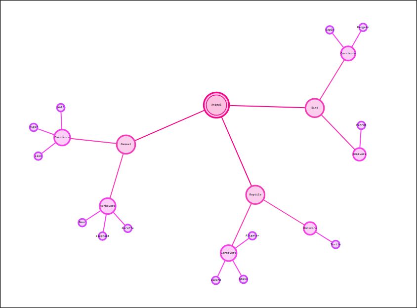

# VertexGraph


VertexJS or VertexGraph is a JavaScript library for creating interactive visualizations of relations and nodes provided in CSV or JSON format. It is designed to be easy to use, highly customizable, and compatible with a wide range of browsers.

## Installation

To use VertexGraph  in your project, simply include the following scripts tag in the head section of your HTML file (alternatively you can download source files and include them to your project):

```html
    <script src="https://d3js.org/d3.v7.min.js" ></script>
    <script src="https://cdn.jsdelivr.net/npm/d3-scale@4" ></script>
    <script src="../../src/GeneralFunctions.js" ></script>
    <script src="../../src/CSVData.js" ></script>
    <script src="../../src/JSONData.js" ></script>
    <script src="../../src/GraphD3.js" ></script>
    <script src="../../src/Main.js" ></script>  
```


## Usage

VertexGraph provides a simple and intuitive API for creating visualizations. Here's a basic example:

```html
    <script>
        const csvUrl = 'animals.csv';   
        VertexGraph = new VertexGraphClass();
        VertexGraph.RunCSV(csvUrl, '#VertexGraph'); 
    </script>
```


This code will create a simple relations graph presenting notes and edges between them and display it in a svg with the ID "VertexGraph".

 


For more examples and documentation, please visit our website.

## Contributing

We welcome contributions from the community! If you would like to contribute to MyLibrary, please read our [contribution guidelines](https://chat.openai.com/chat/CONTRIBUTING.md) and [code of conduct](https://chat.openai.com/chat/CODE_OF_CONDUCT.md) before getting started.
